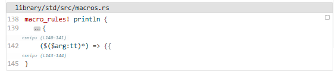

## Example 1: Multiple collapsible sections {.smaller}

:::: {.columns}
::: {.column}
Result

```{.python .fold-example1}
import pandas as pd
import numpy as np

# ===== Helper functions (collapsible) =====
def calculate_mean(data):
    return np.mean(data)

def calculate_std(data):
    return np.std(data)
# ===== Up to this point =====

data = [1, 2, 3, 4, 5]

# ===== Error handling function (collapsible) =====
try:
    result = calculate_mean(data)
except Exception as e:
    print(f"Error: {e}")
    result = None
# ===== Up to this point =====

print(f"Result: {result}")
```

You can expand the folded lines by clicking them. And if you click the expanded lines, they will be folded again.

:::

::: {.column}
To use this plugin, add a class as shown below.
````
```{.python .fold-example1}
...
```
````

`.fold-example1` is defined as `example1` in `code-fold-config.js`.

``` json
  "blocks": {
    "example1": [
      {
        "startLine": 3,
        "endLine": 11,
      },
      {
        "startLine": 13,
        "endLine": 21,
        "summary": "Error handling function"
      },
    ],
```
:::
::::

## Example 2: Attribute-based (no configuration file required)

```{.python data-fold-lines="3-5,7-9" data-fold-summary="'Data Preparation', ''"}
import numpy as np

# Data Preparation
x = np.array([1, 2, 3, 4, 5])
y = np.array([2, 4, 6, 8, 10])

# Computation
mean_x = np.mean(x)
mean_y = np.mean(y)

print(f"Mean X: {mean_x}, Mean Y: {mean_y}")
```

You can also directly define the configuration in a code block like this.
````
```{.python data-fold-lines="3-5,7-9" data-fold-summary="'Data Preparation', ''"}
```
````
If you use an empty string in `data-fold-summary` or omit `data-fold-summary` itself, `<snip>` is used for the folded line symbols.

## Example 3: Single collapsible section

```{.r .fold-example3}
library(ggplot2)

# ===== Initialization logic (collapsible) =====
options(warn = -1)
theme_set(theme_minimal())
colors <- c("#E69F00", "#56B4E9", "#009E73")
default_size <- 12
# ===== Up to this point =====

ggplot(mtcars, aes(x = wt, y = mpg)) +
  geom_point()
```

## Example 4: JavaScript (no line numbers)

```{.javascript .fold-example4 code-line-numbers=false}
// Main Logic
function main() {
  const data = fetchData();
  processData(data);
}

// ===== Helper functions (collapsible) =====
function fetchData() {
  return fetch('/api/data')
    .then(res => res.json());
}
// ===== Up to this point =====

main();
```


## Example 5: Inline folding {.smaller}

```{.python fold-line-ranges="1:3-10, 2:4-11, 4:4-"}
import pandas as pd
import numpy as np

x = np.array([1 , 2, 3, 4, 5])
```

You can also use inline folding.
````
```{.python fold-line-ranges="1:3-10, 2:4-11, 4:4-"}
````

- For line-based folding, specify it using `data-fold-line-ranges` or simply `fold-line-ranges`. Either of the following formats can be used:
  - *line-number*:*start*-*end*
  - *line-number*:*start*-
    - The latter folds from the start position to the end of the line.

## Example 6: Combining with `add-code-files`

Try the following after setting up [`add-code-files`](https://github.com/shafayetShafee/add-code-files).

````
::: {add-from=./rust-src/1.90.0/macros.rs start-line=138 end-line=145}
```{.rust filename="library/std/src/macros.rs" fold-lines="140-141,143-144" fold-line-ranges="139:3-10, 140:4-11, 143:4-"}
```
:::
````

::: {width=100%}
{.r-stretch width=100%}
:::